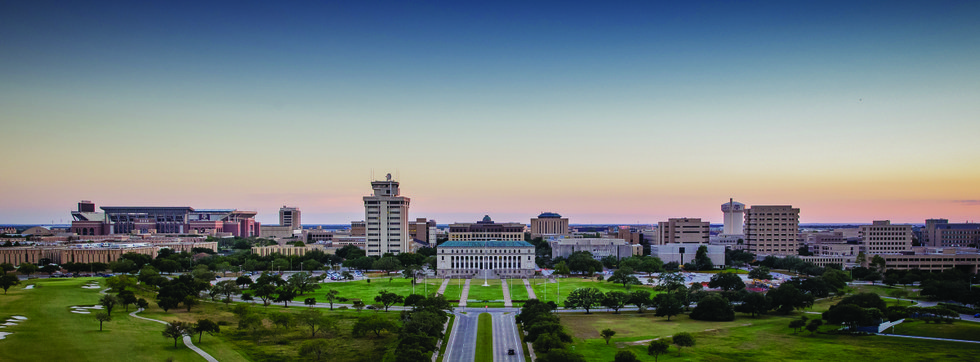
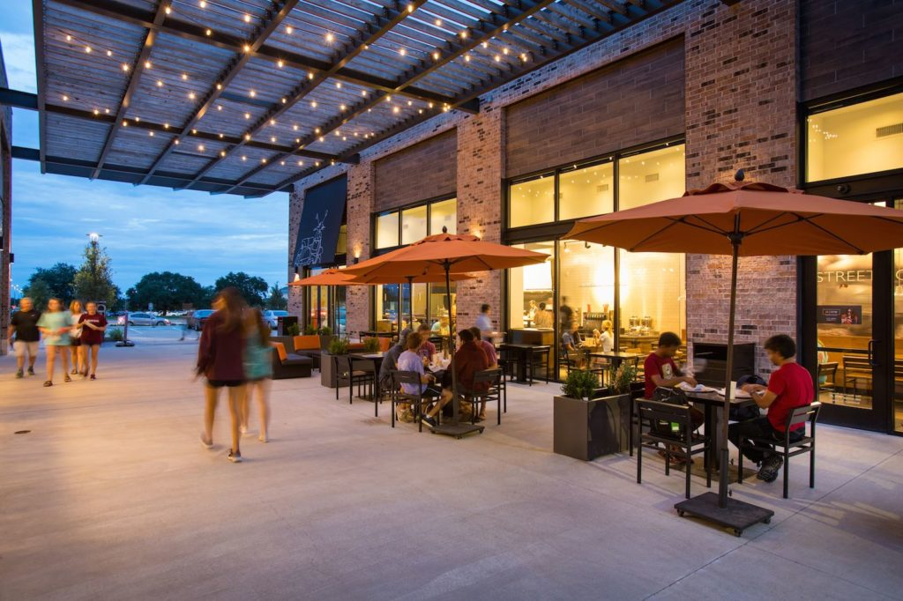

<h1 align = "center">
  👍 Aggieland Eats🍴
</h1>

<p align="center">
  

A full-stack application designed to simplify the process of exploring, reviewing, and enjoying local College Station restaurants.


## Description
Are you overwhelmed by the vast and ever-growing dining scene in College Station? For new students and residents, the challenge of discovering delicious local eateries is real. 

Through the use of our web-based application, our users can painlessly discover and review local restaurants. 


<p align="center">
  
</p>


## Table of Contents:
* [Technologies](#technologies)
* [Setup](#setup)
* [Stretch Goals](#stretch-goals)
* [Credits](#credits)


## Technologies
* ReactJS
* Node.js
* Express.js
* MongoDB
* MongoDB Atlas (Free Tier)
* Mongoose


## Setup
To run this project, you need to install these below:
* Install ReactJS [here](https://react-cn.github.io/react/downloads.html)
* Install Node.js [here](https://nodejs.org/ro/download)
* Install Express.js [here](https://expressjs.com/en/starter/installing.html)
* Install MongoDB [here](https://www.mongodb.com/docs/manual/installation/)
* Access MongoDB Atlas [here](https://www.mongodb.com/atlas/database)
* Install Mongoose [here](https://www.npmjs.com/package/mongoose)

Once you have downloaded all the required technologies:
```
% git clone git@github.com:Summer23-CSCE-310-Database-Systems/github-setup-aggieland_eats.git

% cd ../github-setup-aggieland_eats/backend
% npm install
% npm start

% cd ../github-setup-aggieland_eats/frontend
% npm install
% npm start
```

The webpage should then open up via [http://localhost:3000](http://localhost:8080)


## Stretch Goals
This is our MVP and we hope to implement these features in the future:
* Recommend restaurants to match user preferences via past reviews and more
* Track dining expenses for users
* Searching for restaurants and user reviews


## Credits
We would like to thank our instructor Dr. Pauline Wade and our teaching assistant Brady Testa, for without them this project would not have been possible.


# AggielandEats
